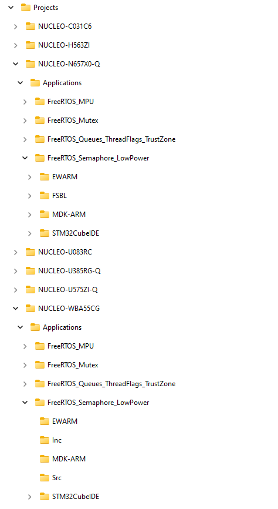

# X-CUBE-FREERTOS FreeRTOS Software Expansion for STM32Cube

With FreeRTOS complementing the extensive STM32Cube ecosystem providing free development tools, software bricks, and software expansion packages, STM32 users can also leverage the rich services of FreeRTOS which meet the needs of tiny, smart, connected devices.

**X-CUBE-FREERTOS** (FreeRTOS RTOS Software Expansion for STM32Cube) provides a full integration of **FreeRTOS** in the STM32Cube environment for the STM32U5 and STM32H5 series of microcontrollers. Ready-to-run applicative examples are also provided for the *NUCLEO-H563ZI* and *NUCLEO-U575ZI-Q*, thus **reducing the learning curve** and ensuring a **smooth application development experience** with FreeRTOS RTOS and STM32U5 or STM32H5 MCUs.

### Prerequisites
- None

One of the following toolchains:

- IAR Embedded Workbench for ARM (EWARM) toolchain 9.20.1 + ST-LINKV3
  - [Utilities\PC_Software\IDEs_Patches\EWARM\EWARMv8_STM32H5xx_V1.0.zip](https://github.com/STMicroelectronics/STM32CubeH5/tree/main/Utilities/PC_Software/IDEs_Patches/EWARM)
- [STM32CubeIDE V1.12.0](https://www.st.com/en/development-tools/stm32cubeide.html)  + ST-LINKV3
- RealView Microcontroller Development Kit (MDK-ARM) toolchain V5.37 + ST-LINKV3
  - [Utilities\PC_Software\IDEs_Patches\MDK-ARM\Keil.STM32H5xx_DFP.1.0.0.zip](https://github.com/STMicroelectronics/STM32CubeH5/tree/main/Utilities/PC_Software/IDEs_Patches/MDK-ARM)

## Supported Devices and Boards by applications
- [NUCLEO-U575ZI-Q](https://www.st.com/en/evaluation-tools/nucleo-u575zi-q.html) *(MB1549C)*
- [NUCLEO-H563ZI](https://www.st.com/en/evaluation-tools/nucleo-h563zi.html) *(MB1404-B02)*

## Repository structure
The STMicroelectronics GitHub X-CUBE-FREERTOS repository consists of the following repositories:
- **Drivers**: contains STM32U5 and STM32H5 CMSIS and HAL drivers.
- **Middlewares**: contains FreeRTOS Middleware files.
- **Projects**: provides ready-to-run applicative examples for FreeRTOS RTOS on the supported boards. Projects are structured as follows:

## Documentation
More comprehensive documentation is available on FreeRTOS [FreeRTOS documentation](https://freertos.org/Documentation/RTOS_book.html).

## License
 None

## Release note

Details about the content of this release are available in the release note [here](https://htmlpreview.github.io/?https://github.com/STMicroelectronics/x-cube-freertos/blob/main/Release_Notes.html).

## Applications

| STM32H5 Applications                                |       Short Description      |
|---------------------------------------------------- |----------------------------------------------------------------|
| FreeRTOS_Mutex                                      | This application demonstrates the use of mutexes to serialize access to a shared resource. [readme](./Projects/NUCLEO-H563ZI/Applications/FreeRTOS_Mutex/README.md) |
| FreeRTOS_MPU                                        | This application demonstrates the use of the MPU with FreeRTOS to control memory/peripheral access for tasks. [readme](./Projects/NUCLEO-H563ZI/Applications/FreeRTOS_MPU/README.md) |
| FreeRTOS_Queues_ThreadFlags_TrustZone               | This application demonstrates the use of message queues, thread flags with CMSIS_RTOS2 API along with the use of FreeRTOS when the TrustZone feature is enabled (TZEN=1) [readme](./Projects/NUCLEO-H563ZI/Applications/FreeRTOS_Queues_ThreadFlags_TrustZone/README.md) |
| FreeRTOS_Semaphore_LowPower                         | This application demonstrates the use of FreeRTOS tickless low power mode and semaphores[readme](./Projects/NUCLEO-H563ZI/Applications/FreeRTOS_Semaphore_LowPower/README.md) |

| STM32U5 Applications                                |       Short Description      |
|---------------------------------------------------- |----------------------------------------------------------------|
| FreeRTOS_Mutex                                      | This application demonstrates the use of mutexes to serialize access to a shared resource. [readme](./Projects/NUCLEO-U575ZI-Q/Applications/FreeRTOS_Mutex/README.md) |
| FreeRTOS_MPU                                        | This application demonstrates the use of the MPU with FreeRTOS to control memory/peripheral access for tasks. [readme](./Projects/NUCLEO-U575ZI-Q/Applications/FreeRTOS_MPU/README.md) |
| FreeRTOS_Queues_ThreadFlags_TrustZone               | This application demonstrates the use of message queues, thread flags with CMSIS_RTOS2 API along with the use of FreeRTOS when the TrustZone feature is enabled (TZEN=1) [readme](./Projects/NUCLEO-U575ZI-Q/Applications/FreeRTOS_Queues_ThreadFlags_TrustZone/README.md) |
| FreeRTOS_Semaphore_LowPower                         | This application demonstrates the use of FreeRTOS tickless low power mode and semaphores[readme](./Projects/NUCLEO-U575ZI-Q/Applications/FreeRTOS_Semaphore_LowPower/README.md) |

## Troubleshooting
**Caution**  : The issues are  **strictly limited**  to submit problems or suggestions related to the software delivered in this repository.

**For any other question**  related to the product, the hardware performance or characteristics, the tools, the environment, you can submit it to the  **ST Community**  on the STM32 MCUs related  [page](https://community.st.com/s/topic/0TO0X000000BSqSWAW/stm32-mcus).

